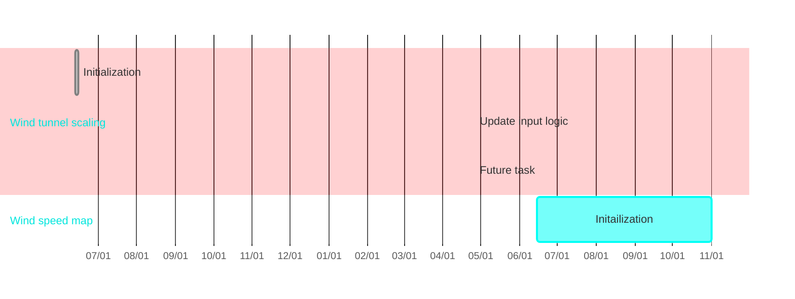

# wind-toolbox
A tool box for wind applications

# TODO

- [ ] Update input logic of the wind tunnel scaling tool.
- [ ] Add a wind hazard map

## Project Timeline

```mermaid
---
title: test
config: 
    theme: base
    themeVariables:
        primaryColor: "#00fff5"
    fontFamily: "Arial"
    gantt:
        axisFormat: "%m/%d"
        titlePosition: "left"
        barHeight: 45
---
gantt
    dateFormat  YYYY-MM-DD
    title  
    excludes weekdays 2022-12-25


    section Wind tunnel scaling
    Initialization            :done,    start, 2023-06-13,2023-06-15
    Update input logic        :active,  des1, 2024-04-26, 1m
    Future task               :         des2, after des1, 3m

    section Wind speed map
    Initailization   :active,  Initailization, 2024-06-15, 2024-11-01
```